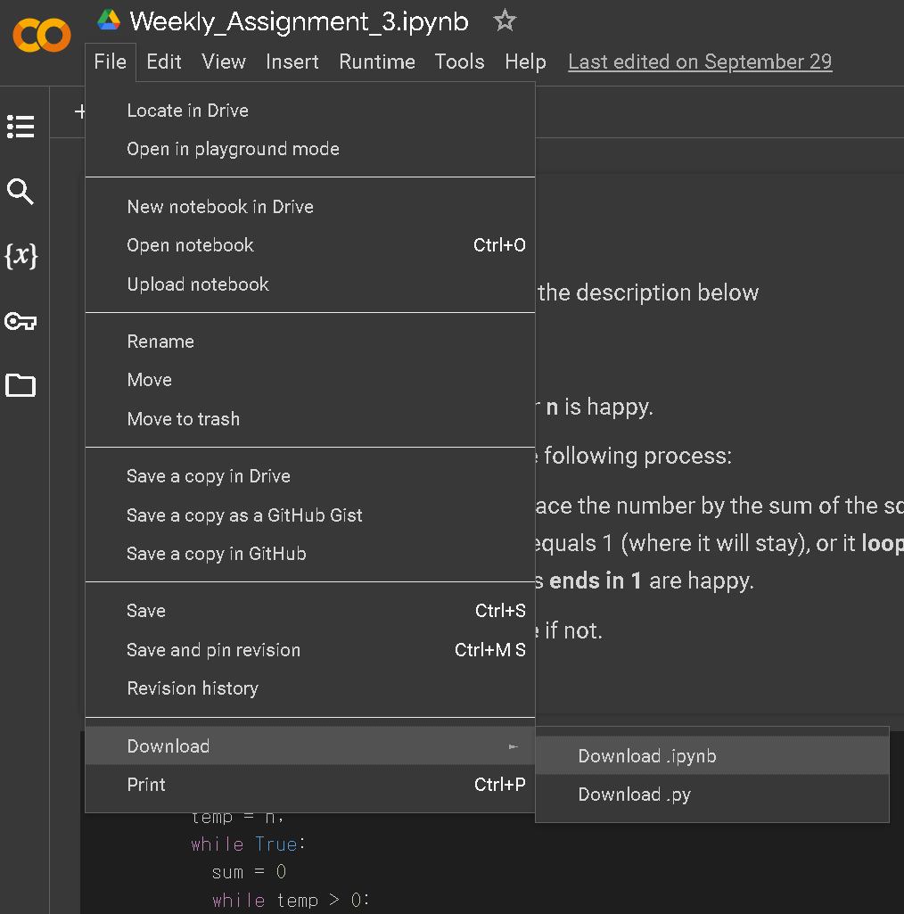
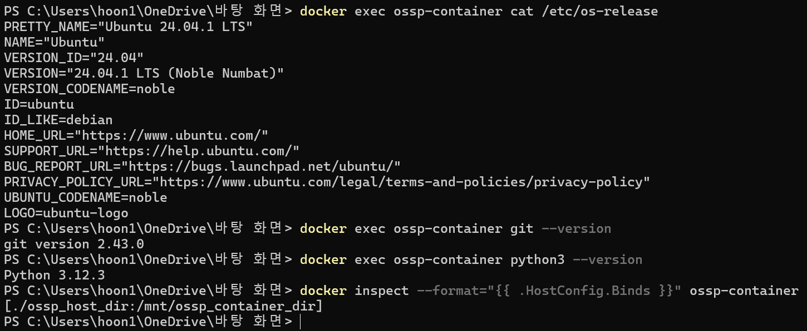

# SWE_2021_41_2024_2_week_6

## 1. iPython(Google Colab)_Assignment (week4)

+ Link to week4_repository [click here](https://github.com/lsh-Brecht/SWE_2021_41_2024_2_week_4 "go to week4_repository")

We implemented a Python function to determine whether a
number is happy.

We programmed in **Google Colab**, saved the results as an ipynb file, and uploaded it to <U>**GitHub repository**.</U>

> ### 1.1 code
```
def isHappy(n):
    arr = []
    temp = n;
    while True:
      sum = 0
      while temp > 0:
        root = temp % 10
        sum += root*root
        temp //=10
      temp = sum
      if(sum == 1):
          happy = True
          break
      if(sum in arr): #이미 나온 거면 무한반복
          happy = False
          break
      arr.append(sum)
    return happy
```
The `isHappy(n)` function checks if `n` is
a "happy number." A happy number is a number where replacing it
with the sum of squares of its digits eventually leads to 1. <u>If it loops endlessly without reaching 1, it's unhappy.</u>

#### how the code works

1. Initialize:
arr tracks previous sums, and temp is set to n.

2. Square Sum:
The function calculates the sum of squares of\
 temp's digits using % and //.

3. **Is this number happy?**:
If sum == 1, return True.\
If sum is already in arr, return False.

4. Return Result:
Returns whether the number is happy or not.

> ## 1.2 How to save a file from Colab to the desktop
> An .ipynb file is a Jupyter Notebook file that contains code and rich text in an interactive format.
>>
>> 

<br>

## 2. Docker_Assignments  (week4)
We set up a **Docker container** with Ubuntu and verified the necessary functionalities(Git and Python) using the commands below.
### 2.1. Docker commands (Ubuntu)
```
apt-get install -y git python3
```  
* Installs Git and Python3 on the container.

```
docker exec <container_name> cat /etc/os-release
```
* Confirms that the container runs the correct Linux distribution.
(Information about the Linux distribution running inside the container.)

```
docker exec <container_name> git --version
```
* Confirms that Git is installed and running properly inside the container.

```
docker exec <container_name> python3 --version
```
* Confirms Python3 is installed and functioning as expected.

```
docker inspect --format="{{ .HostConfig.Binds }}" <container_name>
```  
* Verifies the bind mount configuration, showing that a directory from the host system is correctly mounted inside the container.

<br>

> ## 2.2 Result of the commands
>> 
> + container_name is ossp-container
> + 
